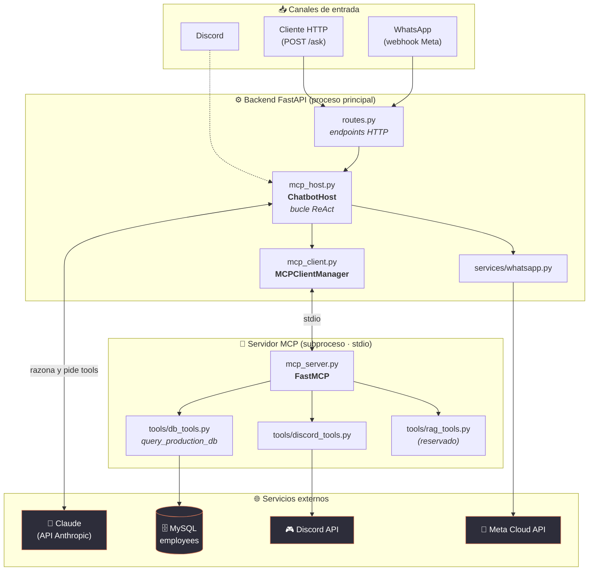
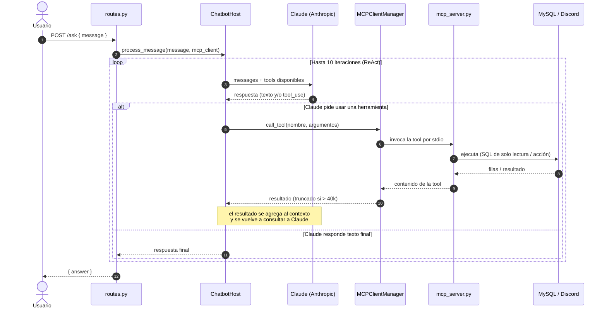

# 🏛️ Arquitectura

Este documento detalla cómo está construido **Chatbot Hub** y cómo fluye una petición a
través del sistema. Los diagramas están en [Mermaid](https://mermaid.js.org/) y se renderizan
automáticamente en GitHub.

El proyecto implementa el patrón **Host → Client → Server** del
[Model Context Protocol](https://modelcontextprotocol.io/): el "cerebro" (host) que conversa
con Claude está **desacoplado** de las herramientas, que viven en un **proceso aparte** y se
comunican por `stdio`.

---

## 1. Vista de componentes

Cómo se relacionan los módulos y los servicios externos.

---

## 2. Flujo de una petición (bucle ReAct)

Qué ocurre, paso a paso, cuando llega un mensaje. El host repite el ciclo
**"preguntar a Claude → ejecutar tools → devolver resultados"** hasta **10 veces** o hasta
que Claude responde con texto final.

---

## 3. Ciclo de vida (startup / shutdown)

El cliente MCP y el host se inicializan **una sola vez** al arrancar, mediante el `lifespan`
de FastAPI, y se reutilizan en cada petición a través de `app.state`.

```mermaid
flowchart LR
    start(["uv run start"]) --> uvicorn["Uvicorn levanta<br/>chatbot.main:app"]
    uvicorn --> lifespan["lifespan() de FastAPI"]
    lifespan --> spawn["get_mcp_client():<br/>lanza subproceso mcp_server.py"]
    spawn --> init["MCPClientManager.initialize()<br/>negocia capacidades + lista tools"]
    init --> state["Guarda mcp_client y<br/>ChatbotHost en app.state"]
    state --> ready(["✅ API lista en :8000"])
    ready -.->|al cerrar| dispose["engine.dispose()<br/>+ cierre del subproceso MCP"]

    classDef ok fill:#1f3a2d,stroke:#3fb950,color:#fff
    class ready ok
```

---

## Referencias

- Resumen general y puesta en marcha: [`README.md`](README.md)
- Convenciones y guía para desarrollar: [`CLAUDE.md`](CLAUDE.md)
- Depuración de las herramientas MCP: [`MPC_INSPECTOR.md`](MPC_INSPECTOR.md)
